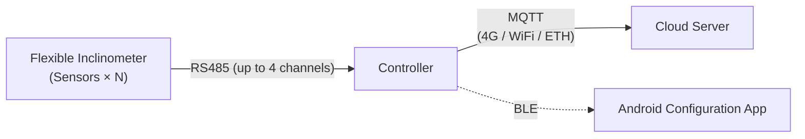

# Flexible Inclinometer Controller System

An industrial-grade flexible inclinometer data acquisition and management system, including CircuitPython embedded firmware and an Android BLE configuration app.

## 📖 Project Overview

This project is a complete **flexible inclinometer / tilt sensor** data acquisition and control system designed for geological hazard monitoring, foundation pit displacement monitoring, slope stability analysis, and similar applications. The system connects up to thousands of sensor nodes through an RS485 bus, collects tilt angle data across the A/B/Z axes, and uploads the data to a cloud server via 4G, WiFi, or Ethernet.

### Core Architecture



---

## 📦 Project Structure

```text
├── firmware/                    # Embedded firmware
│   ├── circuitpython/           #   CircuitPython firmware source code
│   │   ├── boot.py              #     USB CDC configuration
│   │   ├── code.py              #     Main program entry point
│   │   ├── pins.py              #     Hardware pin definitions (44 GPIO)
│   │   ├── config.json          #     Runtime configuration
│   │   ├── app/                 #     Application-layer modules
│   │   │   ├── config_mgr.py    #       Configuration manager
│   │   │   ├── data_formatter.py#       Segmented JSON formatting
│   │   │   ├── data_logger.py   #       Local CSV logging
│   │   │   └── upload_counter.py#       Upload sequence counter
│   │   ├── drivers/             #     Hardware drivers
│   │   │   ├── rs485.py         #       RS485 + DE/VCC control
│   │   │   ├── modem_4g.py      #       4G module (SIM7672E)
│   │   │   ├── wifi.py          #       WiFi connection
│   │   │   ├── ethernet.py      #       W5500 Ethernet
│   │   │   ├── voltage.py       #       ADC voltage monitoring
│   │   │   ├── power.py         #       Power management (sleep)
│   │   │   └── led.py           #       LED status indicator
│   │   └── lib/                 #     Communication protocol libraries
│   │       ├── private_v2026.py #       Private protocol V2026
│   │       ├── modbus_rtu.py    #       Modbus RTU
│   │       └── ble_uart.py      #       BLE UART (NUS)
│   ├── deploy_circuitpython.sh  #   Firmware deployment script
│   └── README.md                #   Detailed firmware documentation
│
├── android/                     # Android configuration app
│   ├── app/                     #   Application source code
│   │   └── src/main/java/       #     Kotlin + Jetpack Compose
│   ├── build.gradle.kts         #   Gradle build configuration
│   ├── gradle/                  #   Gradle Wrapper
│   └── README.md                #   App user guide
│
├── README.md                    # This file
├── git-push-guide.md            # Git push guide
└── .gitignore
```

---

## ✨ Features

### 🔧 Firmware (CircuitPython 10.x - Synchronous Architecture)

| Category | Feature | Description |
|:---|:---|:---|
| **Sensor Acquisition** | Multi-channel RS485 | 2 hardware UART channels + 2 SC16IS752 I2C expansion channels |
| | Multi-protocol support | Private protocol V2026 / Modbus RTU |
| | Address scanning | AutoID scanning from 0 to 1023 with real-time progress feedback |
| | Batch operations | Batch address writing, model writing, and Modbus ID configuration |
| **Data Upload** | 4G MQTT | SIM7672E module with PSM power-saving mode |
| | WiFi MQTT | Alternative wireless upload channel |
| | W5500 Ethernet | Wired network upload |
| | USB CDC | Local serial data output |
| | Segmented JSON | Automatic segmentation, up to 15 sensors per segment |
| **Low Power** | Deep sleep | ~10 µA, supports scheduled wake-up |
| | Light sleep | ~130 µA, RTC remains active |
| | Acquisition interval | Configurable from 5 minutes to 24 hours |
| **Configuration Management** | BLE configuration | Nordic UART Service (NUS) |
| | USB CDC commands | Full command-line interface |
| | NVM mode control | Instant switching between device/computer read-write modes |
| **Data Storage** | Local CSV | Automatically stored in daily/monthly files |
| | USB access | Direct access to data files as a USB drive |
| **Others** | OTA update | Remote firmware update via HTTP |
| | Auto registration | Obtains device ID from server on first startup (YYYY75XXXX) |
| | Time synchronization | 4G > WiFi NTP > ETH NTP > BLE phone sync |

### 📱 Android App (Kotlin + Jetpack Compose)

| Page | Feature | Description |
|:---|:---|:---|
| **Connection Page** | BLE scanning and connection | Automatically discovers UniControl devices with PIN pairing |
| **Configuration Page** | A4 full scan | Scans all sensors on the COM port |
| | Address/model modification | One-to-one update of sensor address (A7) and model (C7) |
| | Modbus ID setting | Assigns Modbus addresses to sensors (AB) |
| | Batch address writing | Scans by AutoID range and writes fixed addresses (A0) |
| **Data Page** | Scan/read data | Real-time acquisition of A/B/Z-axis data |
| | Model management | Batch reading/setting of sensor models |
| **Settings Page** | Device configuration | ID, acquisition interval, sleep mode |
| | Network configuration | 4G (APN/operator), WiFi, MQTT |
| | Advanced settings | RS485 expansion, merged packets, local storage, USB drive mode |

---

## 🔌 Hardware Specifications

| Parameter | Specification |
|:---|:---|
| **Main controller chip** | N16R8 |
| **Flash** | 16 MB |
| **PSRAM** | 8 MB |
| **GPIO usage** | 44 / 48 |
| **RS485 channels** | 2 hardware UART + 2 SC16IS752 expansion channels (optional) |
| **4G module** | SIM7672E |
| **Ethernet** | W5500 SPI (optional) |
| **ADC** | 7-channel ADC1 voltage monitoring |
| **BLE** | Nordic UART Service |
| **USB** | CDC data port + Mass Storage |

### Communication Interfaces

| Channel | Type | TX | RX | DE | VCC | ADDR |
|:---:|:---|:---:|:---:|:---:|:---:|:---:|
| COM1 | Hardware UART | GPIO17 | GPIO18 | GPIO16 | GPIO4 | GPIO15 |
| COM2 | Hardware UART | GPIO38 | GPIO39 | GPIO40 | GPIO41 | GPIO42 |
| COM3 | SC16IS752 | I2C | I2C | GPIO11 | GPIO12 | GPIO13 |
| COM4 | SC16IS752 | I2C | I2C | GPIO14 | GPIO27 | GPIO28 |

---

## 📡 Data Upload Format

Sensor data is uploaded via MQTT in segmented JSON format:

**Header Segment (seg: 0/n)**

```json
{
  "cid": 2026750055,
  "v": "2026.02.09-sync",
  "sdt": "107",
  "vin": 12.35,
  "clock": "2/5/2026 22:30:00",
  "time": 1738765800,
  "hib": 5,
  "signal": "CSQ:31,99",
  "sid1num": 25,
  "seg": "0/2"
}
```

**Data Segment (seg: 1/n)** — sorted by address in descending order, with the bottom end first

```json
{
  "cid": 2026750055,
  "time": 1738765800,
  "seg": "1/2",
  "data": [
    [26110025, -0.55, 0.71, "C", 1, 998.70],
    [26110024, -0.52, 0.68, "C", 1, 999.20],
    [26110001, -0.15, 0.23, "C", 1, 1001.50]
  ]
}
```

Data format: `[address, A-axis angle, B-axis angle, status, 1, Z-axis]`

Status: `C` = normal, `W` = no response

---

## 🔋 USB Read/Write Mode

Device/computer read-write permission control is implemented based on NVM (non-volatile memory):

| nvm[0] | Mode | Device | Computer |
|:---:|:---|:---:|:---:|
| **17** | Daily mode | **Read/write** | Read-only |
| Other values | Flashing mode | Read-only | **Read/write** |
| - | No USB connection | **Read/write** | N/A |

Switching commands: BLE `set_usb_rw` / CDC `#enable_usb_rw` / `#disable_usb_rw`

---

## 🚀 Quick Start

### Firmware Deployment

```bash
cd firmware
./deploy_circuitpython.sh
```

### Android App Build

```bash
cd android

# Debug version
./gradlew assembleDebug

# Release version
./gradlew assembleRelease
```

---

## 📖 Detailed Documentation

| Document | Description |
|:---|:---|
| [Firmware README](firmware/README.md) | Detailed firmware description, pin definitions, and CDC/BLE command set |
| [Android README](android/README.md) | App feature description and build guide |
| [Git Push Guide](git-push-guide.md) | Guide for pushing the code to GitHub |

---

## 📜 License

MIT License
```
